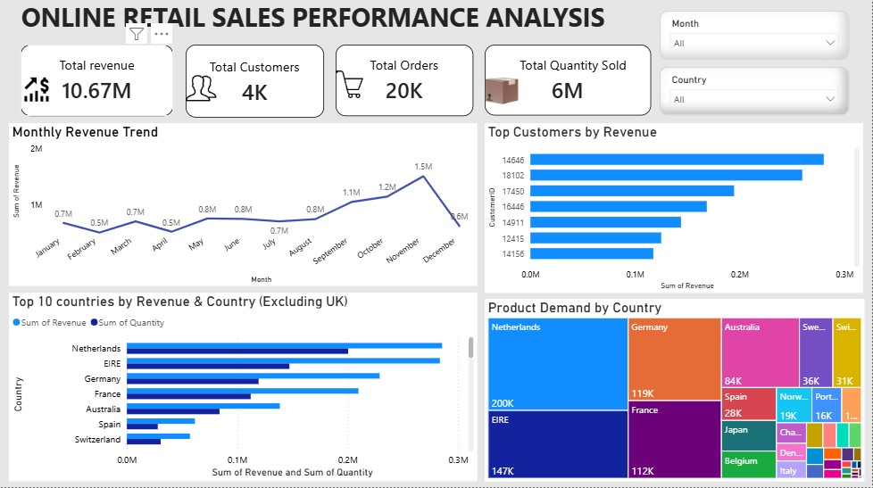

# 🛒 Online Retail Sales Analysis
## 📌 Summary 
This project was completed as part of the Tata Data Visualization: Empowering Business with Effective Insights Virtual Experience Program on Forage. The project analyzes Uk online retail sales using Power BI to identify revenue trends, customer behaviour, and international sales opportunities. The project demonstrates my ability to clean and transform data, build interactive dashboards, and communicate business insights that support data-driven decision-making.
## 🎯 Business Problem
The business needed to understand:
- How revenue changed throughout 2011
- Which customers generated the most revenue
- Which countries (excluding the UK) presented the greatest expansion opportunities
- Seasonal sales patterns for better planning
## 🎯 Objectives
- Analyze monthly revenue trends
- Identify top-performing customers
- Evaluate which country generated most revenue
- Build an interactive dashboard for decision-making
## ⚙ Methodology
**Data Preparation (Power Query)**
- Explored, cleaned, and transformed the online retail dataset by removing cancelled transactions, filtering invalid records, correcting data types, and preparing the data for analysis
**Business Intelligence & Dashboard Design (Powwer BI)**
- Developed DAX measures and interactive visualization to identify revenue trends, identify top-performing customers, evaluate international sales performance, and communicate actionable business insights
## 🛠 Tools used
- Microsoft Power BI
- Power Query
- DAX
- Microsoft Excel
## 📈 Dashboard Features
- KPI cards - Total revenue, Total customers, Total orders, Total quantity sold
- Monthly revenue trend breakdown for 2011
- TOP 10 customers by revenue
- Top revenue-generating countries
- Sales distribution
## 📸 Dashboard preview

## 📁 Files
- 📊 Power BI Dashboard (.pbix) [View](https://github.com/janniee2/Online-Retail-Sales-Analysis/blob/main/tata%20visualization.pbix)
- 📁 Dataset (.xlsx) [View](https://github.com/janniee2/Online-Retail-Sales-Analysis/blob/main/Online%20Retail.xlsx)
- 🖼 Dashboard screenshot [View](https://github.com/janniee2/Online-Retail-Sales-Analysis/blob/main/online-retail-dashboard.jpg)
 ## 🔍 Key insights
 - Revenue remained relatively stable during the first three quarters of 2011 before increasing significantly in the final quarter. Sales peaked at approximately $1.5 million in November, followed by a noticeable decline in December
 - After excluding the United Kingdom, the Netherlands, EIRE (Ireland), Germany, and France generated the highest revenue and sales volume
 - Revenue was driven by a small group of customers
 - The demand distribution highlights that countries such as the Netherlands, Germany, France, and Australia recorded consistently higher purchase quantities than many other international markets
 - Countries with the highest sales quantities also generated the highest revenue, indicating a strong relationship between customer demand and overall business performance
## 💡 Recommendation
- Prepare Early for Peak Sales Seasons-particularly from September through November, to meet rising customer demand and avoid stock shortages
- Invest More in High-Performing International Markets
- Strengthen Customer Retention Strategies - Since a significant portion of revenue comes from a relatively small customer base, the business should: Develop customer loyalty programs, Offer personalized promotions, Maintain proactive customer engagement, and Reward repeat purchases
- Explore Growth Opportunities in countries with lower sales volumes through targeted marketing campaigns, localized promotions, and improved product availability
## 📫 Connect with me
- Linkedin: https://www.linkedin.com/in/jane-ibeh-17062118b
## 🎓 Certificate
This project was completed as part of the Tata Data Visualization Virtual Program
📜 View Certificate: [Certificate](https://github.com/janniee2/Online-Retail-Sales-Analysis/blob/main/Tata_completion_certificate.pdf)
